# 🚀 Investica
### *AI-Powered Financial Assistant for Next-Gen Trading*

<div align="center">


**Revolutionizing portfolio management through intelligent AI agents**

</div>

---

## Demo Video [Link](https://www.youtube.com/watch?v=dB_8vFpqT1Y)

## 🌟 Overview

**Investica** is a cutting-edge AI-powered financial assistant that transforms how retail investors approach portfolio management and trading. Built for the **DTCC i-Hack 2025 - Drishtikon**, our platform leverages advanced agentic AI workflows to deliver seamless integration between Indian markets (via Zerodha Kite API) and global financial insights.

### 🎯 What Makes Investica Special?

```mermaid
graph TD
    A[👤 User Query] --> B[🧠 AI Routing Agent]
    B --> C[📊 Portfolio Assessment]
    B --> D[⚡ Trade Execution]
    B --> E[📋 Post-Trade Processing]
    C --> F[💼 Smart Recommendations]
    D --> F
    E --> F
    F --> G[📱 Beautiful UI Response]
```



---

## ✨ Core Features

<table>
<tr>
<td width="50%">

### 🔍 **Intelligent Portfolio Analysis**
- **Real-time Assessment**: Live portfolio health monitoring
- **Multi-source Data**: Combines Zerodha + global financial data
- **AI Insights**: Advanced recommendation engine
- **Risk Analytics**: Comprehensive risk profiling

</td>
<td width="50%">

### ⚡ **Smart Trade Execution**
- **Market Optimization**: Real-time condition analysis
- **Automated Trading**: GTT and conditional orders
- **Multi-asset Support**: Stocks, derivatives, and more
- **Performance Tracking**: Live P&L monitoring

</td>
</tr>
<tr>
<td width="50%">

### 🤖 **Agentic AI Workflow**
- **7 Specialized Agents**: Each optimized for specific tasks
- **Natural Language**: Chat-based interface
- **Memory Persistence**: Context-aware conversations
- **Workflow Orchestration**: Seamless agent collaboration

</td>
<td width="50%">

### 🌐 **Global Market Intelligence**
- **Indian Markets**: Full Zerodha Kite integration
- **US Markets**: Comprehensive financial datasets
- **Crypto Insights**: Digital asset analysis
- **News Integration**: Real-time market sentiment

</td>
</tr>
</table>

---

## 🏗️ Architecture Deep Dive

### 🤖 Meet the AI Agents

<div align="center">

| Agent | Role | Technology | Key Features |
|-------|------|------------|-------------|
| 🧭 **Routing Agent** | Query orchestration | Claude + AWS Bedrock | NLP parsing, task distribution |
| 📊 **Portfolio Assessor** | Investment analysis | Pydantic AI | Risk assessment, recommendations |
| 🎯 **Trade Executor** | Order management | LangGraph | Smart execution, optimization |
| 📋 **Post-Trade Manager** | Settlement processing | MCP Protocol | Reconciliation, reporting |
| 🌍 **Financial Analyst** | Global data analysis | Financial Datasets API | Fundamental analysis, insights |
| 💹 **Zerodha Agent** | Indian market interface | Kite API | Trading, portfolio data |
| 📤 **Output Agent** | Response synthesis | Streamlit | Visualization, user experience |

</div>

### 🔄 Workflow Architecture


## 🛠️ Technology Stack

<div align="center">

### **Agentic AI Infrastructure**


### **Frontend & UI**


### **Data & APIs**


</div>

---

## 🚀 Quick Start

### 📋 Prerequisites

- **Python 3.11+** 🐍
- **Git** 📚
- **AWS Bedrock Access** ☁️
- **SupaBase Account** 🗄️

### 🔑 Required API Keys

| Service | Purpose | Get From |
|---------|---------|----------|
| 🏦 Zerodha Kite | Indian market trading | [kite.trade](https://kite.trade) |
| 📈 Financial Datasets | Global market data | [financialdatasets.ai](https://financialdatasets.ai) |
| 🤖 AWS Bedrock | Claude AI access | [AWS Console](https://aws.amazon.com/bedrock) |
| 🗄️ SupaBase | Database persistence | [supabase.com](https://supabase.com) |

### ⚡ Installation

1. **Clone the repository**
   ```bash
   git clone https://github.com/finos-labs/dtcc-i-h-2025-drishtikon.git
   cd dtcc-i-h-2025-drishtikon
   ```

2. **Set up virtual environment**
   ```bash
   uv venv
   source venv/bin/activate  # Windows: venv\Scripts\activate
   uv sync
   ```

3. **Configure environment variables**
   ```bash
   cp .env.example .env
   # Edit .env with your API keys
   ```

4. **Launch the application**
   ```bash
   streamlit run app.py
   ```

5. **Access your dashboard**
   ```
   🌐 http://localhost:8501
   ```

---

## 💡 Usage Examples

### 🎯 Sample Queries

<table>
<tr>
<td width="50%">

**📊 Portfolio Analysis**
```
"Analyze my current portfolio 
and suggest optimization strategies"
```

**📈 Investment Research**
```
"Research AAPL fundamentals and 
compare with Indian tech stocks"
```

</td>
<td width="50%">

**⚡ Smart Trading**
```
"Buy 100 RELIANCE shares if 
price drops below ₹2900"
```

**📋 Trade Management**
```
"Show me today's trade summary 
with P&L breakdown"
```

</td>
</tr>
</table>

### 📊 Sample Output

```markdown
## 📊 Portfolio Health Report

| 🏢 Stock | 📊 Qty | 💰 Avg Price | 📈 Current | 🎯 Action |
|----------|---------|--------------|------------|-----------|
| RELIANCE | 100     | ₹2,950      | ₹3,000     | 🟢 **HOLD** |
| TCS      | 50      | ₹4,100      | ₹4,150     | 🔴 **SELL** (Overvalued) |
| INFY     | 75      | ₹1,650      | ₹1,700     | 🟡 **MONITOR** |

### 🌍 Global Insights - AAPL
- **📈 Revenue (2024)**: $390.1B – Steady growth trajectory
- **💡 Recommendation**: Consider adding for portfolio diversification
- **🎯 Target Price**: $195 (Current: $185)

### ⚡ Automated Actions Taken
✅ Placed GTT order: Sell 50 TCS @ ₹4,200  
✅ Set price alert: AAPL below $180  
✅ Updated risk profile: Moderate → Balanced  
```

---

## 🎨 Screenshots


---
## 📄 License

This project is licensed under the **MIT License** - see the [LICENSE](LICENSE) file for details.

---

## 🙏 Acknowledgments

- **DTCC i-Hack 2025** for the amazing opportunity
- **Zerodha** for their excellent Kite API
- **Anthropic** for Claude AI capabilities
- **Open Source Community** for incredible tools and libraries

---

<div align="center">

## 🚀 **Ready to Transform Your Trading?**

**Built with ❤️ for the future of financial technology**

---

*Investica - Where AI meets smart investing* ✨


</div>

## Team Information

### Team Name - Drishtikon

### Team Members
* Luv Kansal
* Jayesh Savaliya
* Vaishnavi Mandhane
* Kunj Vipul Goyal
